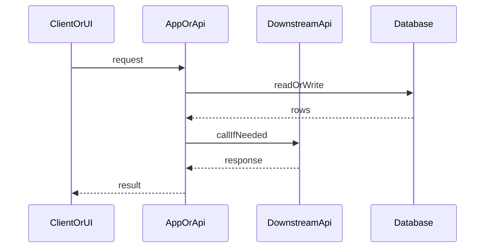

Copy into `.my-docs/workflow/<slug>/`. [handoffs.md](../handoffs.md) · [LEGACY.md](../LEGACY.md).

# 03-design.md

```markdown
# Design: <short title>

**Mode:** full | simple — from `00-run.md`

<!-- full: two Decision options below. simple: one recommended design + ≤3-line rejected alternative (use full Option 1/2 only if 2+ approaches still unsettled). -->

## Decision 1: which design approach?

### Option 1 — <short name> (required)

**What it is:**
Plain-words explanation of this approach.

**Example:**
One concrete example (file path, API shape, UI flow, or command).

**Pros:**

-

**Cons:**

-

### Option 2 — <short name>

<!-- Required in Mode full. In Mode simple: replace with "Rejected alternative (≤3 lines): …" unless 2+ approaches remain unsettled. -->

**What it is:**
Plain-words explanation of this approach.

**Example:**
One concrete example (file path, API shape, UI flow, or command).

**Pros:**

-

**Cons:**

-

## Tradeoffs

<!-- Mode full: fill table. Mode simple: optional one-line tradeoff note. -->

| Factor | Option 1 | Option 2 |
|--------|----------|----------|
| Cost / time | | |
| Complexity | | |
| Usability | | |
| Failure cases | | |

## Recommendation

**Pick Option N** because … (one short paragraph in plain words).  
Mode simple with single design: **Pick Option 1** (recommended) — note rejected alternative if any.

## Chosen design (user-approved)

<!-- Fill after Gate B -->

## System design

**Required section** — fill Overview **or** `N/A` (never omit the heading).

### When to fill vs N/A

| Signal | Action |
|--------|--------|
| **Has API = yes** or **Has DB = yes** | Overview **required** (not N/A) |
| Mode **full** and new/changed trust boundary, data flow, or consistency model | Overview **required** |
| Mode **simple**, no API/DB, copy/token or tiny local UI only | Prefer `N/A — no system-design change; <reason>` |
| Unsure | Fill a short Overview; do not invent a new architecture |

Prefer **repo architecture first** (`docs/ARCHITECTURE.md`, feature/workspace patterns), then well-known styles.

### Ownership (do not blur with Design patterns)

- **System design** = runtime shape: boundaries, who owns data, request path, consistency, failure domains, scale.
- **Design patterns used** = code/module structure: how files/components are organized (Compound Component, Repository, Presenter, etc.).
- Same name must not appear in both unless you say which lens (system vs code) in one line.

### Anti-duplication (required)

- **Point to** Sequence diagram / Contracts / OWASP — do **not** restate field lists, mermaid steps, or the full OWASP table here.
- Overview teaches *why* the shape exists; diagram/contracts show *how* it wires.

### Line budget

- Overview: ≤ ~12 short bullets total across the fields below.
- Concept N: optional; ≤3 concepts; each uses the teach shape (≤ ~8 lines).

If none apply: `N/A — no system-design change; <brief reason>.`

When not N/A, fill **Overview** (always). Add **Concept N** only for ideas the reader should learn.

### Overview

- **What it is:** Short lesson — how the system is shaped for *this* change (1–4 sentences). Not a buzzword list.
- **Components / boundaries:** Who owns what; trust boundaries; actors (names only — details in sequence diagram).
- **Data flow:** Happy path in one short paragraph; where state lives; sync vs async if relevant. Point to Contracts for fields.
- **Consistency & failure:** What must be strongly consistent; what can lag; key failure *classes* (point to diagram for returns).
- **Why this shape:** Why this architecture fits *this* problem (one-line rejected alternative when useful).
- **Best practices:** 2–4 must-follow practices (repo first). Call out **anti-patterns / traps**.
- **Reference:** Repo path and/or known style (feature slice, BFF, workspace-scoped monolith, CQRS-lite, etc.).

### Concept N — <name>

<!-- Optional. Named system ideas only (e.g. workspace tenancy, optimistic UI + server source of truth). -->

- **What it is:**
- **How we use it here:**
- **Why we chose it:**
- **Best practices:**
- **Reference:**

#### Mini example (do not copy into every doc — teach quality bar)

```markdown
### Overview
- **What it is:** Workspace-scoped Baby GraphQL: the UI calls Yoga under `/api/baby`; resolvers read the workspace cookie and only touch that workspace’s rows.
- **Components / boundaries:** Client UI → Baby API route → Yoga resolvers → Postgres (Drizzle). No cross-workspace reads.
- **Data flow:** Mutation validates input → writes care row → returns updated fields. Client refetches or updates local form state. (Fields: see Contracts.)
- **Consistency & failure:** Write is strongly consistent in DB. Auth/workspace miss → error to UI; no partial cross-tenant write.
- **Why this shape:** Matches existing Money/Baby workspace shell; avoids a second BFF.
- **Best practices:** Resolve workspace once per request; never take workspace id from the client body alone; keep mutations additive.
- **Anti-patterns:** Dual-writing the same fact from UI and a background job without one write owner.
- **Reference:** `docs/ARCHITECTURE.md` — workspace-scoped feature APIs.
```

## Sequence diagram

Main request path: components ↔ app/API ↔ downstream APIs ↔ database.



<!-- Replace participants and messages for this design. Include key failure returns when they matter. -->

## Contracts

### API contracts

For each new or changed endpoint / handler:

| Item | Detail |
|------|--------|
| Method + path (or name) | |
| Auth / who can call | |
| Request fields | name, type, required |
| Success response | |
| Errors | code/status + when |
| Downstream calls | if any |

**Events / other module APIs (if any):**

-

### Database contracts

For each new or changed table / collection:

| Table / collection | Purpose | Key fields (name, type) | Indexes / uniques | Write owner | Read owners |
|--------------------|---------|-------------------------|-------------------|-------------|-------------|
| | | | | | |

**Data ownership notes:**

-

### Example queries

Main happy-path reads/writes (1–3). Use the project’s usual style (SQL / Drizzle / etc.). Mark placeholders.

```sql
-- Example 1: <what it does>
-- SELECT ...
```

```sql
-- Example 2: <what it does>
-- INSERT ...
```

## Design patterns used

**Required section** — teach code/module patterns **or** `N/A` (never omit the heading). Prefer **repo patterns first**, then well-known names. Usually **1–3** patterns; skip fluff and one-off local habits.

### When to fill vs N/A

| Signal | Action |
|--------|--------|
| Analysis lists reusable patterns, or Build must follow a named structure | Fill Pattern N (teach shape) |
| Only local conventions / one-file tweak | `N/A — no named pattern beyond local conventions; <reason>` |
| Inventing a new structure while a repo pattern exists | **Not allowed** — reuse and teach the repo pattern |

### Ownership

- Code/module organization only — see **System design** for runtime boundaries.
- Do not duplicate System design Concept N under another name.

### Anti-duplication

- Map **How we use it here** to files/components; do not paste API/DB field tables.

### Line budget

- ≤3 patterns; each Pattern N ≤ ~8 short lines (teach shape below).

If none apply: `N/A — no named pattern beyond local conventions; brief reason.`

For **each** pattern that matters:

### Pattern N — <name>

- **What it is:** Short lesson — what the pattern is and what problem class it solves (1–3 sentences).
- **How we use it here:** Concrete mapping to *this* design (files, layers, UI pieces).
- **Why we chose it:** Why this pattern fits *this* problem (one-line alternative when useful).
- **Best practices:** 2–4 must-follow practices (repo first). Call out **anti-patterns / traps**.
- **Reference:** Repo path and/or well-known name (e.g. Compound Component, Repository, Presenter).

Optional summary when 2+ patterns:

| Pattern | Why chosen (one line) | Reference |
|---------|----------------------|-----------|
| | | |

#### Mini example (do not copy into every doc — teach quality bar)

```markdown
### Pattern 1 — Compound control
- **What it is:** A parent owns shared state; children render parts of one control so the UX stays one unit.
- **How we use it here:** `BabyPumpForm` owns ml/side state; chips and submit are children that call parent setters.
- **Why we chose it:** Matches existing feed/diaper controls; avoids prop-drilling twins.
- **Best practices:** One source of truth in the parent; keep children presentational; mirror state in the skeleton.
- **Anti-patterns:** Each chip holding its own “selected” copy that can disagree with the form.
- **Reference:** `components/baby-feed-form.tsx` (same compound style).
```

## UI / UX / mobile

<!-- If no UI: write `N/A — no UI` and skip the bullets. -->

- **UI (when Has UI):** specify layout/IA/chrome in this design — align with Gate A #1/#2 and existing app patterns; do not invent a conflicting IA
- **Build ↔ UI lock (when Has UI):** state that implementation must match Design UI specs + reused live chrome (size, positions, texts).
- **80/20 UI (required when UI):** apply the Gate A 80/20 rule end-to-end:
  - Main user goals; vital few features/problems
  - Core actions visually dominant (clear placement, hierarchy, labels, fewer steps, defaults, feedback); secondary in menus / overflow / expand / modal
  - Always name Important info/action #1 and #2 on the primary UI; do not expose every feature at once
  - Fix biggest usability problems before polish; optimize the top journey; sensible defaults; note what to measure after ship
- **Layout / hierarchy:**
- **Loading / empty / error / success:**
- **Skeleton parity (zero CLS):**
- **Mobile (thumb reach, ≥44px hits, no hover-only, small viewport):**
- **Accessibility basics:**
- **Day-to-day usage notes:** how this UI supports daily use (Gate A already ran on ideation; keep design aligned — do not re-argue 80/20 goals)

## Security design review (OWASP)

Design-time pass only (trust boundaries + abuse cases + table). Full OWASP on **implementation** runs in the **security lens** after Build — do not duplicate that audit here.

Trust boundaries:

-

Abuse cases:

-

| OWASP | Status (pass / fail / N/A) | Note |
|-------|----------------------------|------|
| A01 Broken Access Control | | |
| A02 Cryptographic Failures | | |
| A03 Injection | | |
| A04 Insecure Design | | |
| A05 Security Misconfiguration | | |
| A06 Vulnerable Components | | |
| A07 Auth Failures | | |
| A08 Software / Data Integrity | | |
| A09 Logging / Monitoring Failures | | |
| A10 SSRF | | |

Source: https://owasp.org/Top10/

## Challenges answered

- Do we need this?
- What fails?
- Is this overspecified?

## Domain / ADR notes

- **Glossary terms used:** (canonical names from `GLOSSARY.md` / grill — or none)
- **ADR:** path written by grill/design — or `N/A — skipped: <three-part bar reason>`
- **Grill locks honored:** list Settled decisions from `02b-grill.md` (or N/A if grill skipped)
```
---
