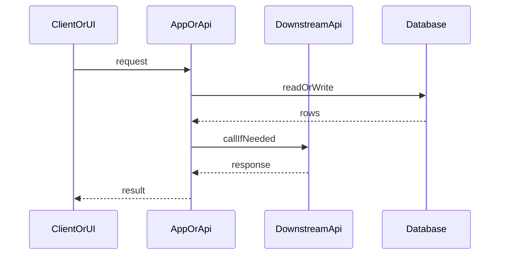

# my-dev-flow templates

Shared by `my-dev-flow` and its subflows. Copy into `.my-docs/workflow/<slug>/`. Keep language simple and plain. Lead with short bold labels where helpful.

---

## Decision options (required for every choice list)

Use this shape in chat **and** in docs whenever there are 2+ options:

- Number the decision: **Decision 1**, **Decision 2**, … (sequential for the run)
- Number each option: **Option 1**, **Option 2**, … (not A/B letters)

For each option:

- **What it is:** plain-words explanation
- **Example:** one concrete example
- **Pros:** …
- **Cons:** …

Then:

- **Recommendation:** which option number to pick and why

Do not list bare names without these fields.

---

## Stage-scoped handoff (required)

Do **not** paste the full artifact catalog into every Task. Use the **base block** + only the paths for that **stage id**.

### Base block (every Task)

```
Repo root: <absolute path>
Workflow slug: <slug>
Stage: <stage-id>
00-run.md: .my-docs/workflow/<slug>/00-run.md
Read only the artifacts listed for this stage (do not open others unless a listed file links to them).
Write only: <write list for stage>
Use simple plain words. Fresh context — do not assume prior chat or other agents' memory.
Honor artifact size caps in my-dev-flow/templates.md.
```

### Stage id → read / write

| Stage id | Read (under `.my-docs/workflow/<slug>/`) | Write |
|----------|------------------------------------------|-------|
| `ideation` | `00-run.md` | `01-idea.md` |
| `gate-a` | `00-run.md`, `01-idea.md` | `01a-idea-ui-review.md` |
| `ideation-update` | `00-run.md`, `01-idea.md`, `01a-idea-ui-review.md` | `01-idea.md` (+ `01a` round notes) |
| `skim` | `00-run.md`, `01-idea.md`, `01a-idea-ui-review.md` | `02-skim.md` |
| `analyze` | `00-run.md`, `01-idea.md`, `02-skim.md` (if present) | `02-analysis.md` |
| `grill` | `00-run.md`, `01-idea.md`, `02-skim.md` (if present), `02-analysis.md`; also repo `GLOSSARY.md` / `GLOSSARY-MAP.md` / ADR dir when present | `02b-grill.md`; may update `02-analysis.md` Settled/Design tree; may update repo `GLOSSARY.md` and/or one ADR |
| `design` | `00-run.md`, `01-idea.md`, `02-skim.md` (if present), `02-analysis.md`, `02b-grill.md` (if present) | `03-design.md`, `04-tasks.md` |
| `design-review` | `00-run.md`, `01-idea.md`, `01a` (if present), `02-skim.md` (if present), `02-analysis.md`, `02b-grill.md` (if present), `03-design.md`, `04-tasks.md` | `03a-design-review-log.md` |
| `api-contract-review` | `00-run.md`, `02-analysis.md`, `03-design.md` (API/DB contracts), `04-tasks.md`, `02-skim.md` (if present), repo `AGENTS.md` / route patterns when present | `03a-design-review-log.md` (API contract review section only) |
| `db-design-review` | `00-run.md`, `02-analysis.md`, `03-design.md` (Database contracts + example queries), `04-tasks.md`, `02-skim.md` (if present), repo `AGENTS.md` / `db/schema` / migration patterns when present | `03a-design-review-log.md` (DB design review section only) |
| `design-update` | `00-run.md`, `03a-design-review-log.md`, `01-idea.md`, `02-skim.md` (if present), `02-analysis.md`, `02b-grill.md` (if present), `03-design.md`, `04-tasks.md` | Fix-ask files only + `03a` round notes |
| `tdd-review` | `00-run.md`, `03-design.md`, `04-tasks.md`, `03a-design-review-log.md` (if present) — **only when planned tests exist** | `04a-tdd-test-review.md` |
| `build` | `00-run.md`, `03-design.md`, `04-tasks.md`, `04a-tdd-test-review.md` (if present) | code (after Gate B) |
| `smoke` | `00-run.md`, `06-test-log.md` | `06-test-log.md` (Smoke section) |
| `adversarial` | `00-run.md`, `04-tasks.md`, `05-review-log.md` + draft code/tests | `05-review-log.md` (Adversarial section) |
| `quality` | `00-run.md`, `01-idea.md`, `03-design.md`, `04-tasks.md`, `05-review-log.md` + draft code | `05-review-log.md` (Quality section) |
| `spm-api` | `00-run.md`, `03-design.md` (API contracts), `04-tasks.md` + draft API/route/validator code | `05-lens-api.md` only |
| `spm-db` | `00-run.md`, `03-design.md` (Database contracts + example queries), `04-tasks.md` + draft schema/migration/query code | `05-lens-db.md` only |
| `spm-security` | `00-run.md`, `03-design.md`, `04-tasks.md` + draft code | `05-lens-security.md` only |
| `spm-perf` | `00-run.md`, `03-design.md`, `04-tasks.md` + draft code | `05-lens-performance.md` only |
| `spm-memory` | `00-run.md`, `03-design.md`, `04-tasks.md` + draft code | `05-lens-memory.md` only |
| `merge-findings` | `00-run.md`, active `05-lens-*.md` for this round, `05-review-log.md` | `05-review-log.md` (Merged SPM) |
| `fix-review` | `00-run.md`, `05-review-log.md` (Fix ask), `03-design.md`, `04-tasks.md` | code + fix notes in `05-review-log.md` |
| `test-full` | `00-run.md`, `04-tasks.md`, `06-test-log.md` | `06-test-log.md` |
| `test-lite` | `00-run.md`, `04-tasks.md`, `06-test-log.md` | `06-test-log.md` (smoke + targeted e2e only) |
| `fix-tests` | `00-run.md`, `06-test-log.md` (Fix ask), `03-design.md`, `04-tasks.md` | code |
| `merge` | `00-run.md`, `06-test-log.md` | PR / merge (no secret files) |

**Prompt tip:** After the base block, paste only the concrete paths for that stage (expand `<slug>`). Example for `design-review`:

```
Read:
- .my-docs/workflow/<slug>/01-idea.md
- .my-docs/workflow/<slug>/02-analysis.md
- .my-docs/workflow/<slug>/03-design.md
- .my-docs/workflow/<slug>/04-tasks.md
(and 01a / 02-skim when present per table; ignore legacy 01b/ui-refs)
Write: .my-docs/workflow/<slug>/03a-design-review-log.md
```

Legacy name: “Shared handoff block” in older stage prompts means **stage-scoped handoff** for that stage id — never the full catalog.

---

## Artifact size caps (required)

Keep artifacts short so later Tasks stay cheap. Soft caps (body content; headings OK):

| Artifact | Cap | Rule |
|----------|-----|------|
| `02-skim.md` | ≤ ~40 lines | Project shape 1–3 sentences; ≤5 rows per table |
| `02-analysis.md` | Overall What/Why/How short; ≤5 solution pieces | Prefer bullets; Spike ≤5 rows; Design tree ≤15 lines |
| `02b-grill.md` | ≤ ~60 lines | Frontier rounds + settled; glossary/ADR pointers only |
| `03-design.md` | See Mode | **full:** two Decision options; **simple:** one recommended design + ≤3-line rejected alternative. **System design** Overview ≤ ~12 bullets (or `N/A`); ≤3 Concept N; each Pattern ≤ ~8 lines; ≤3 patterns — point to sequence/contracts instead of restating; cut prose elsewhere if needed |
| `03a` / `04a` Fix ask | ≤10 bullets | Critical/Major first |
| `05-review-log` Fix ask | ≤15 bullets | Ranked; defer Enhancements when profile allows |
| Parent post-step check | First ~40 lines | Read **Result** / Fix ask header only — do not re-read full design docs |

If a cap would hide a Critical risk, keep the risk and cut prose elsewhere.

---

## 00-run.md

```markdown
# Workflow run: <slug>

**Status:** ideation | gate-a | skim | analyze | grill | design | design-review | tdd-review | gate-b | build | smoke | review | test | gate-c | done | stopped

**Mode:** full | simple — set after complexity check (or override/resume); see my-dev-flow **Mode selection**

**Complexity:** simple | complex — one-line reason (e.g. `simple — clear bug fix` / `complex — new multi-surface feature`)

**Review profile:** full | lite | skip-review — set at Step 0 (see my-dev-flow **Review profile**)

**SPM plan:** none | api | db | security | perf | memory | api+db | api+security | … — set before code review from signals (see **Conditional lenses**). Include **api** when **Has API = yes**. Include **db** when **Has DB = yes**.

**Last stage:** (e.g. `Gate A done`, `skim done`, `Gate B auto`) — resume from the next incomplete step; do not redo completed gates unless artifacts changed

## Resolved models

| Tier | Slug | Notes |
|------|------|-------|
| High | | Analyze, Design, Update |
| Medium | | Creative/judgment Medium stages when available (incl. Grill) |
| Fast | | Build, Fix, Smoke, Test, Merge; **also mechanical Medium stages when Medium unavailable** |

**Preferred defaults:** High `claude-opus-5-thinking-high` · Medium `gpt-5.6-sol-medium` · Fast `composer-2.5-fast`

**Fallback:** High → Medium → Fast → `inherit` · Medium → Fast → `inherit` · Fast → `inherit`.

**Mechanical → Fast:** If preferred Medium is missing, mechanical stages (Gate A, skim, grill, design-review, API contract review, DB design review, TDD review, Adversarial, Quality, SPM/API/DB lenses, Merge findings) **must use Fast when Fast is available** — do not jump to `inherit` while Fast works. Note fallbacks in Notes.

## Repo

- **Root:**
- **Branch:**
- **Started:**
- **Last stage:**
- **Has UI:** yes | no | unknown — **set in Ideation** (do not wait for Gate A). UI specs go in Design (no UI concept / Gate A2).
- **Has API:** yes | no | unknown — set when contracts are clear (Analyze/Design or earlier). When yes: isolated **API contract review** at design-review + **api** lens at code review.
- **Has DB:** yes | no | unknown — set when schema/migrations/persistence queries are clear (Analyze/Design or earlier). When yes: isolated **DB design review** at design-review + **db** lens at code review.
- **HITL Gate B:** auto | async-notify | blocking — see my-dev-flow **HITL tiers**
- **HITL Gate C:** blocking — **always**. Never auto/async. No commit/push/PR/merge without explicit user yes.
- **04a:** run | skipped — reason (skipped when no planned test cases):

## Orchestrator card (parent — avoid re-ingest)

Update after each step. Parent reads **this card + one stages.md section** for the next Task. Do **not** re-read full subflow `SKILL.md` every step (load once per phase, or when Mode/profile changes).

| Field | Value |
|-------|-------|
| Phase | design \| code \| review \| test \| merge |
| Next step | (e.g. Step 4a TDD review) |
| Task description | (card title) |
| Stage id | (handoff table id) |
| stages.md section | path + heading only |
| Model tier | High \| Medium \| Fast (mechanical→Fast rule if Medium missing) |
| Prereq Result | (e.g. design-review clean) |
| Artifact to check | path — read first ~40 lines / Result only |
| Main-thread fallback | none \| `<stage>` (usage limit after wait 5s + one retry) — only that stage; next stages still Task |

## Gates

Canonical names (legacy aliases in parentheses):

- [ ] Gate A — Day-to-day + 80/20 (auto when `01a` Result ok) *(legacy: Gate 1 + Gate 2-UI)*
- [ ] Gate B — Design + tasks (+ tests if planned) approved *(legacy: Gate 2)* — HITL tier: auto | async-notify | blocking; user-first when auto; skim **System design** + **Design patterns used** when blocking
- [ ] Gate C — Commit / push / PR / merge approved *(legacy: Gate 3)* — **always blocking**; ask for each action explicitly

## Notes

-

## Run log

Newest at the bottom. Format: `- **HH:MM** · running|done|paused|stopped · Step … · note`

Example usage-limit lines:
`- **HH:MM** · done · Step 2 — Analyze · usage-limit retry — waited 5s`
`- **HH:MM** · done · Step 2 — Analyze · main-thread fallback — usage limit after retry`

-
```
---

## 01-idea.md

```markdown
# Idea: <short title>

## Problem

What hurts today?

## User / audience

Who is this for?

## Outcome

What does “done” look like?

## Metric

How do we know it worked? (one clear signal)

## Sources (primary)

Investigate the question against primary sources (official docs, source code, specs, first-party APIs), not a secondary write-up of them. Follow every claim back to the source that owns it.

| Claim / topic | Primary source (path, URL, or API) | Notes |
|---------------|--------------------------------------|-------|
| | | |

## Has UI

**yes | no** — set clearly here; parent copies into `00-run.md` during Ideation (before Gate A).

## Lean / skip hints

- **Copy/token-only?** yes | no
- **UI notes for Design:** (short — surfaces to touch; no separate UI concept step)

## 80/20 UI (day-to-day)

If this change has a UI (else `N/A — no UI`):

### Main user goals

What users come here to accomplish (list the real jobs):

-

### Vital few (high-impact ~20%)

Features / problems that matter most for most users (from usage, support, interviews, or clear product judgment):

-

### Primary UI — core actions dominant

- **Important info / action #1 (always visible):**
- **Important info / action #2 (always visible):**
- **Core action placement:** clear placement, strong hierarchy, descriptive labels, fewer steps, helpful defaults, immediate feedback
- **Secondary actions:** menus / overflow / less prominent areas / expand / modal / context menu — list what is deferred:

-

### Top user journey to optimize

Map the most common path (example: Open → Search → Select → …):

-

### Sensible defaults

What should be preselected so most users do less work?

-

### Biggest usability risks to fix first

Unclear nav, hard forms, hidden errors, etc. — fix these before polish:

-

## Non-goals

What we will **not** build in this pass:

-

## Assumptions to attack

| Assumption | Must be true? | Fastest way to kill it | If false, what changes? |
|------------|---------------|------------------------|-------------------------|
| | | | |

## What we should not build

-

## Success criteria

- [ ]
- [ ]

## Open questions

-
```

---

## 01a-idea-ui-review.md

```markdown
# Idea day-to-day review (Gate A): <slug>

**Result:** pending | ok | needs update | escalate
**Round:** 1
**Updated:**
**Role:** end user (day-to-day usage) — fresh context only

## 80/20 UI rule (required when UI)

Focus on the vital few that deliver most day-to-day value. Progressive disclosure: keep the main surface focused; hide rare options.

### 1. Main user goals

What users come to accomplish (list):

-

### 2. Vital few features / problems

High-impact ~20% (most used or most painful). Sources if known: analytics, support, interviews, usability — else product judgment:

| Vital few item | Why it is high-impact |
|----------------|------------------------|
| | |

### 3. Core actions visually dominant

Primary tasks need: clear placement, strong hierarchy, descriptive labels, fewer steps, helpful defaults, immediate feedback. Secondary actions → menus, overflow, expand, modal, or less prominent areas.

| Item | Value |
|------|-------|
| Important info / action #1 (always visible) | |
| Important info / action #2 (always visible) | |
| Secondary / deferred (expand / modal / menu / overflow) | |
| Core actions dominant? | yes / no |

### 4. Biggest usability problems first

Fix confusion that hits most users before polish (nav, forms, hidden errors, etc.):

| Problem | Fix first? | Note |
|---------|------------|------|
| | yes / no / n/a | |

### 5. Simplify the interface

Rarely used options removed or hidden so they do not distract from common tasks:

| Pass? | Note |
|-------|------|
| yes / no | |

### 6. Top user journeys

Most common workflow mapped and prioritized over rare screens:

| Journey steps (Open → … → done) | Optimized? |
|---------------------------------|------------|
| | yes / no |

### 7. Sensible defaults

Preselect what most users choose (forms, filters, checkout-like flows):

| Default | Why it helps most users |
|---------|-------------------------|
| | |

### 8. Test, measure, repeat (plan)

What to track after ship (completion, errors, abandonment, conversion, time on task) — or N/A if too early:

-

**80/20 overall pass?** yes / no

## Day-to-day checklist

| Focus | Pass? | Note |
|-------|-------|------|
| 80/20 UI (goals → vital few → dominant core → simplify → journey → defaults) | yes / no | |
| Convenience (few steps, low friction in daily use) | yes / no | |
| Easy to use (clear actions, low learning cost) | yes / no | |
| Understanding (problem + outcome make sense to a real user) | yes / no | |
| Mobile usability (usable on phone / on the go if relevant; N/A ok) | yes / no / n/a | |
| Eye reading flow (scannable top-to-bottom; clear hierarchy in the idea) | yes / no | |

## Findings

| Severity | Finding | Suggestion for 01-idea.md |
|----------|---------|---------------------------|
| Critical / Major / Enhancement / Nit | | |

## Fix ask for Ideation

Concrete updates to `01-idea.md` (section + what to change):

1.
2.

## Auto-approve?

- **Yes** if Result is **ok** (all Critical/Major cleared; **80/20 overall pass**; day-to-day checklist acceptable) → parent checks **Gate A**.
- **No** if **needs update** or **escalate**. Missing main goals, vital few, #1/#2 core actions, or a cluttered primary UI → **needs update** (not ok).

## Round notes

-
```

---

## 01b-ui-concept.md / ui-refs (REMOVED)

**Do not create** on new runs. UI concept + Gate A2 were removed from my-dev-flow.

When Has UI: put layout/IA/chrome locks in `03-design.md` and acceptance in `04-tasks.md`. Match existing app patterns. Legacy `01b` / `ui-refs` in old slugs may remain on disk; ignore for new pipeline steps.

---

## 02-skim.md

```markdown
# Light repo skim: <slug>

**Result:** pending | done | skipped
**Updated:**
**Size:** keep ≤ ~40 lines (cap) — short tables (≤5 rows each)
**Purpose:** constraints only — ground Analyze / Design in what already exists. Not a full analysis.

## Project shape (1–3 sentences)

-

## Related existing UI / screens

| Path | What it does | Reuse? |
|------|--------------|--------|
| | | |

## Related APIs / data

| Path or route | Notes |
|---------------|-------|
| | |

## Hard constraints (do not fight)

1.
2.

## Risks if we ignore the repo

-

## Enough for Analyze / Design?

yes | no — if no, list one blocking question:

-
```

---

## 02-analysis.md

```markdown
# Analysis: <short title>

**Size:** Prefer bullets. ≤5 solution pieces. Spike ≤5 rows. Stay within artifact size caps.

## Deep dive (required)

Answer for the overall change. Repeat the three questions under **Solution pieces** for each major piece (API, schema, UI surface, integration, etc.). Ask the user when unclear — do not guess.

### Overall

#### What is this?
Plain words: the problem, surface, or change.

#### Why do we need this?
User/business outcome. What fails or hurts if we skip it.

#### How to do this?
Proposed approach in plain words.
- **Other ways:** at least one realistic alternative (or “none — constrained by X”).
- **Best practices:** repo patterns first, then industry norms.
- If 2+ real approaches: use Decision N + Option 1/2 (What it is / Example / Pros / Cons / Recommendation).

### Solution pieces

For each major piece:

#### <Piece name>

##### What is this?
-

##### Why do we need this?
-

##### How to do this?
- Approach:
- Other ways:
- Best practices:

## What exists today

1–3 sentences + key paths. (Build on `02-skim.md` when present — do not ignore skim constraints.)

## Dependencies

What else must change or stay compatible?

## Reference files (for Build)

| Path | Why it matters |
|------|----------------|
| | |

## Reusable patterns (prefer in Design)

Discover candidates here; **Design** expands chosen ones into teachable **Design patterns used** in `03-design.md`.

| Pattern / name | Where it lives | Why Design should reuse it |
|----------------|----------------|----------------------------|
| | | |

## System shape candidates (prefer in Design)

Discover architecture candidates here; **Design** expands into teachable **System design** in `03-design.md` (or marks `N/A`).

| Shape / concept | Where it lives (repo or known name) | Why Design should teach it |
|-----------------|-------------------------------------|----------------------------|
| | | |

## Constraints and risks

-

## Settled decisions (do not relitigate)

-

## Design tree (frontier)

Stub for **Grill** (`02b-grill.md`). Keep short.

### Settled
- (prerequisites already locked — Gate A, prior Decisions, repo constraints)

### Open frontier
- (askable now — prerequisites settled)

### Blocked
- (needs settled X first)

**Grill recommended?** yes | no — yes if Open frontier or unsettled Decisions remain; Mode full usually yes.

## Spike notes (optional)

Throwaway exploration only — not production Build. Same What / Why / How before and after.

| Spike | What / Why / How summary | Finding | Keep or discard |
|-------|--------------------------|---------|-----------------|
| | | | |

## Blocking questions

-

## Clear to grill / design?

yes | no — if no, list the gap:
```

---

## 02b-grill.md

```markdown
# Grill: <slug>

**Result:** frontier-empty | needs-round | skipped
**Updated:**
**HITL:** auto | async-notify | blocking — from Gate B tier; prefer auto
**Size:** ≤ ~60 lines

## Design tree summary

- **Settled:** …
- **Open frontier:** … (empty when Result frontier-empty)
- **Blocked:** …

## Frontier round N

❓ **Q1** — **<title>**: <body; choices if 2+>

➡️ Recommended: … — user-first: …

**Settled as:** … (auto-pick | human) — rationale: …

---

❓ **Q2** — …

## Edge scenarios

| Scenario | Outcome / rule locked |
|----------|------------------------|
| | |

## Domain modeling

### Glossary updates
- Term → definition (or `none this round`)
- Paths touched: `GLOSSARY.md` | mapped context | none

### ADR
- **Wrote:** path — or **Skipped:** reason (fails three-part bar / obvious / easy to reverse)

## Auto-pick log

- `auto-pick — Qn → … — user-first: …; system: …`

## Grill digest (≤4 bullets)

1. What settled
2. Top residual risk (or none)
3. Glossary / ADR touch
4. Ready for Design? yes/no
```

---

## 03-design.md

```markdown
# Design: <short title>

**Mode:** full | simple — from `00-run.md`

<!-- full: two Decision options below. simple: one recommended design + ≤3-line rejected alternative (use full Option 1/2 only if 2+ approaches still unsettled). -->

## Decision 1: which design approach?

### Option 1 — <short name> (required)

**What it is:**
Plain-words explanation of this approach.

**Example:**
One concrete example (file path, API shape, UI flow, or command).

**Pros:**

-

**Cons:**

-

### Option 2 — <short name>

<!-- Required in Mode full. In Mode simple: replace with "Rejected alternative (≤3 lines): …" unless 2+ approaches remain unsettled. -->

**What it is:**
Plain-words explanation of this approach.

**Example:**
One concrete example (file path, API shape, UI flow, or command).

**Pros:**

-

**Cons:**

-

## Tradeoffs

<!-- Mode full: fill table. Mode simple: optional one-line tradeoff note. -->

| Factor | Option 1 | Option 2 |
|--------|----------|----------|
| Cost / time | | |
| Complexity | | |
| Usability | | |
| Failure cases | | |

## Recommendation

**Pick Option N** because … (one short paragraph in plain words).  
Mode simple with single design: **Pick Option 1** (recommended) — note rejected alternative if any.

## Chosen design (user-approved)

<!-- Fill after Gate B -->

## System design

**Required section** — fill Overview **or** `N/A` (never omit the heading).

### When to fill vs N/A

| Signal | Action |
|--------|--------|
| **Has API = yes** or **Has DB = yes** | Overview **required** (not N/A) |
| Mode **full** and new/changed trust boundary, data flow, or consistency model | Overview **required** |
| Mode **simple**, no API/DB, copy/token or tiny local UI only | Prefer `N/A — no system-design change; <reason>` |
| Unsure | Fill a short Overview; do not invent a new architecture |

Prefer **repo architecture first** (`docs/ARCHITECTURE.md`, feature/workspace patterns), then well-known styles.

### Ownership (do not blur with Design patterns)

- **System design** = runtime shape: boundaries, who owns data, request path, consistency, failure domains, scale.
- **Design patterns used** = code/module structure: how files/components are organized (Compound Component, Repository, Presenter, etc.).
- Same name must not appear in both unless you say which lens (system vs code) in one line.

### Anti-duplication (required)

- **Point to** Sequence diagram / Contracts / OWASP — do **not** restate field lists, mermaid steps, or the full OWASP table here.
- Overview teaches *why* the shape exists; diagram/contracts show *how* it wires.

### Line budget

- Overview: ≤ ~12 short bullets total across the fields below.
- Concept N: optional; ≤3 concepts; each uses the teach shape (≤ ~8 lines).

If none apply: `N/A — no system-design change; <brief reason>.`

When not N/A, fill **Overview** (always). Add **Concept N** only for ideas the reader should learn.

### Overview

- **What it is:** Short lesson — how the system is shaped for *this* change (1–4 sentences). Not a buzzword list.
- **Components / boundaries:** Who owns what; trust boundaries; actors (names only — details in sequence diagram).
- **Data flow:** Happy path in one short paragraph; where state lives; sync vs async if relevant. Point to Contracts for fields.
- **Consistency & failure:** What must be strongly consistent; what can lag; key failure *classes* (point to diagram for returns).
- **Why this shape:** Why this architecture fits *this* problem (one-line rejected alternative when useful).
- **Best practices:** 2–4 must-follow practices (repo first). Call out **anti-patterns / traps**.
- **Reference:** Repo path and/or known style (feature slice, BFF, workspace-scoped monolith, CQRS-lite, etc.).

### Concept N — <name>

<!-- Optional. Named system ideas only (e.g. workspace tenancy, optimistic UI + server source of truth). -->

- **What it is:**
- **How we use it here:**
- **Why we chose it:**
- **Best practices:**
- **Reference:**

#### Mini example (do not copy into every doc — teach quality bar)

```markdown
### Overview
- **What it is:** Workspace-scoped Baby GraphQL: the UI calls Yoga under `/api/baby`; resolvers read the workspace cookie and only touch that workspace’s rows.
- **Components / boundaries:** Client UI → Baby API route → Yoga resolvers → Postgres (Drizzle). No cross-workspace reads.
- **Data flow:** Mutation validates input → writes care row → returns updated fields. Client refetches or updates local form state. (Fields: see Contracts.)
- **Consistency & failure:** Write is strongly consistent in DB. Auth/workspace miss → error to UI; no partial cross-tenant write.
- **Why this shape:** Matches existing Money/Baby workspace shell; avoids a second BFF.
- **Best practices:** Resolve workspace once per request; never take workspace id from the client body alone; keep mutations additive.
- **Anti-patterns:** Dual-writing the same fact from UI and a background job without one write owner.
- **Reference:** `docs/ARCHITECTURE.md` — workspace-scoped feature APIs.
```

## Sequence diagram

Main request path: components ↔ app/API ↔ downstream APIs ↔ database.



<!-- Replace participants and messages for this design. Include key failure returns when they matter. -->

## Contracts

### API contracts

For each new or changed endpoint / handler:

| Item | Detail |
|------|--------|
| Method + path (or name) | |
| Auth / who can call | |
| Request fields | name, type, required |
| Success response | |
| Errors | code/status + when |
| Downstream calls | if any |

**Events / other module APIs (if any):**

-

### Database contracts

For each new or changed table / collection:

| Table / collection | Purpose | Key fields (name, type) | Indexes / uniques | Write owner | Read owners |
|--------------------|---------|-------------------------|-------------------|-------------|-------------|
| | | | | | |

**Data ownership notes:**

-

### Example queries

Main happy-path reads/writes (1–3). Use the project’s usual style (SQL / Drizzle / etc.). Mark placeholders.

```sql
-- Example 1: <what it does>
-- SELECT ...
```

```sql
-- Example 2: <what it does>
-- INSERT ...
```

## Design patterns used

**Required section** — teach code/module patterns **or** `N/A` (never omit the heading). Prefer **repo patterns first**, then well-known names. Usually **1–3** patterns; skip fluff and one-off local habits.

### When to fill vs N/A

| Signal | Action |
|--------|--------|
| Analysis lists reusable patterns, or Build must follow a named structure | Fill Pattern N (teach shape) |
| Only local conventions / one-file tweak | `N/A — no named pattern beyond local conventions; <reason>` |
| Inventing a new structure while a repo pattern exists | **Not allowed** — reuse and teach the repo pattern |

### Ownership

- Code/module organization only — see **System design** for runtime boundaries.
- Do not duplicate System design Concept N under another name.

### Anti-duplication

- Map **How we use it here** to files/components; do not paste API/DB field tables.

### Line budget

- ≤3 patterns; each Pattern N ≤ ~8 short lines (teach shape below).

If none apply: `N/A — no named pattern beyond local conventions; brief reason.`

For **each** pattern that matters:

### Pattern N — <name>

- **What it is:** Short lesson — what the pattern is and what problem class it solves (1–3 sentences).
- **How we use it here:** Concrete mapping to *this* design (files, layers, UI pieces).
- **Why we chose it:** Why this pattern fits *this* problem (one-line alternative when useful).
- **Best practices:** 2–4 must-follow practices (repo first). Call out **anti-patterns / traps**.
- **Reference:** Repo path and/or well-known name (e.g. Compound Component, Repository, Presenter).

Optional summary when 2+ patterns:

| Pattern | Why chosen (one line) | Reference |
|---------|----------------------|-----------|
| | | |

#### Mini example (do not copy into every doc — teach quality bar)

```markdown
### Pattern 1 — Compound control
- **What it is:** A parent owns shared state; children render parts of one control so the UX stays one unit.
- **How we use it here:** `BabyPumpForm` owns ml/side state; chips and submit are children that call parent setters.
- **Why we chose it:** Matches existing feed/diaper controls; avoids prop-drilling twins.
- **Best practices:** One source of truth in the parent; keep children presentational; mirror state in the skeleton.
- **Anti-patterns:** Each chip holding its own “selected” copy that can disagree with the form.
- **Reference:** `components/baby-feed-form.tsx` (same compound style).
```

## UI / UX / mobile

<!-- If no UI: write `N/A — no UI` and skip the bullets. -->

- **UI (when Has UI):** specify layout/IA/chrome in this design — align with Gate A #1/#2 and existing app patterns; do not invent a conflicting IA
- **Build ↔ UI lock (when Has UI):** state that implementation must match Design UI specs + reused live chrome (size, positions, texts).
- **80/20 UI (required when UI):** apply the Gate A 80/20 rule end-to-end:
  - Main user goals; vital few features/problems
  - Core actions visually dominant (clear placement, hierarchy, labels, fewer steps, defaults, feedback); secondary in menus / overflow / expand / modal
  - Always name Important info/action #1 and #2 on the primary UI; do not expose every feature at once
  - Fix biggest usability problems before polish; optimize the top journey; sensible defaults; note what to measure after ship
- **Layout / hierarchy:**
- **Loading / empty / error / success:**
- **Skeleton parity (zero CLS):**
- **Mobile (thumb reach, ≥44px hits, no hover-only, small viewport):**
- **Accessibility basics:**
- **Day-to-day usage notes:** how this UI supports daily use (Gate A already ran on ideation; keep design aligned — do not re-argue 80/20 goals)

## Security design review (OWASP)

Trust boundaries:

-

Abuse cases:

-

| OWASP | Status (pass / fail / N/A) | Note |
|-------|----------------------------|------|
| A01 Broken Access Control | | |
| A02 Cryptographic Failures | | |
| A03 Injection | | |
| A04 Insecure Design | | |
| A05 Security Misconfiguration | | |
| A06 Vulnerable Components | | |
| A07 Auth Failures | | |
| A08 Software / Data Integrity | | |
| A09 Logging / Monitoring Failures | | |
| A10 SSRF | | |

Source: https://owasp.org/Top10/

## Challenges answered

- Do we need this?
- What fails?
- Is this overspecified?

## Domain / ADR notes

- **Glossary terms used:** (canonical names from `GLOSSARY.md` / grill — or none)
- **ADR:** path written by grill/design — or `N/A — skipped: <three-part bar reason>`
- **Grill locks honored:** list Settled decisions from `02b-grill.md` (or N/A if grill skipped)
```
---

## 03a-design-review-log.md

```markdown
# Design review log: <slug>

**Result:** pending | clean | needs update
**Round:** 1
**Updated:**

## API contract review (when Has API)

Filled by the isolated **API contract review** Task only. Skip section when Has API = no.

**Result:** pending | clean | needs update | skipped
**Updated:**

| Severity | Area | Finding | Suggestion |
|----------|------|---------|------------|
| Critical / Major / Enhancement / Nit | contracts / practice | | |

**API checklist:** typed I/O · one error shape · edge validation · pagination · additive fields · naming · idempotency · matches repo patterns

## DB design review (when Has DB)

Filled by the isolated **DB design review** Task only. Skip section when Has DB = no.

**Result:** pending | clean | needs update | skipped
**Updated:**

| Severity | Area | Finding | Suggestion |
|----------|------|---------|------------|
| Critical / Major / Enhancement / Nit | schema / migration / query / ownership / practice | | |

**DB checklist:** typed columns · indexes/uniques · write/read owners · additive or expand/contract migration · safe binds · bounded lists · tenant filters · design↔schema match

## Findings

| Severity | Area | Finding | Suggestion |
|----------|------|---------|------------|
| Critical / Major / Enhancement / Nit | idea / ui / analysis / grill / design / tasks / contracts / diagram / system-design / pattern / ui-ux / security-owasp / practice / api-contract / db-design / glossary-adr | | |

## Fix ask for my-design-subflow

Concrete updates (file + what to change):

1.
2.

## Round notes

-
```

---

## 04-tasks.md

```markdown
# Tasks: <short title>

## Task 1: <title>

**Description:**

**Acceptance:**

- [ ]

**Tests (TDD — what turns red first):**

- [ ]

**Files likely touched:**

**Scope:** S | M

**Dependencies:** none | Task #

---

## Task 2: <title>

**Description:**

**Acceptance:**

- [ ]

**Tests (TDD — what turns red first):**

- [ ]

**Files likely touched:**

**Scope:** S | M

**Dependencies:**

---

## Checkpoints

After every 2–3 tasks:

- [ ] Focused tests pass
- [ ] Slice works end-to-end where applicable
```

---

## 04a-tdd-test-review.md

**Only create when** `04-tasks.md` has planned test cases. If none → skip; note in `00-run.md` (`04a skipped — no planned test cases`).

```markdown
# TDD test-case review: <slug>

**Result:** pending | clean | needs more tests
**Round:** 1
**Updated:**

## Planned / existing test cases reviewed

| Task | Scenario type (real / edge) | Test case | Covered? |
|------|-----------------------------|-----------|----------|
| | | | yes / no / partial |

## Gaps (must add before or during Build)

| Severity | Task | Missing scenario | Suggested test |
|----------|------|------------------|----------------|
| Critical / Major / Enhancement | | | |

## Real scenarios checked

- Happy path:
- User-visible failures:
- Empty / loading / permission:

## Edge scenarios checked

- Boundaries / invalid input:
- Concurrency / double-submit / idempotency:
- Offline / partial data / race (if relevant):

## Fix ask for Build

Concrete tests to add or strengthen:

1.
2.

## Round notes

-
```

---

## 05-review-log.md

```markdown
# Review log: <short title>

## Adversarial test review

| Severity | Location | Finding | Status |
|----------|----------|---------|--------|
| | | | open / fixed |

**Round notes:**

---

## Quality

| Severity | Location | Finding | Status |
|----------|----------|---------|--------|
| | | | |

**Round notes:**

---

## Merged SPM (API ‖ DB ‖ Security ‖ Performance ‖ Memory)

Filled by the **Merge findings** arbiter after each parallel round. Lens raw output lives in `05-lens-api.md`, `05-lens-db.md`, `05-lens-security.md`, `05-lens-performance.md`, `05-lens-memory.md` (only files for lenses in SPM plan this round).

**Round:** 1
**Result:** pending | clean | needs fix

### Winners (fix these)

| Severity | Sources (api/db/security/perf/memory) | Finding | Decision |
|----------|---------------------------------------|---------|----------|
| | | | keep / merged |

### Conflicts resolved (losers)

| Dropped / demoted finding | Lost to | Why |
|---------------------------|---------|-----|
| | | |

### Fix ask (for Fix agent)

1.
2.

**Round notes:**

---

## Fix notes (TDD skipped)

List any docs-only items where TDD was skipped:
```

---

## 05-lens-api.md / 05-lens-db.md / 05-lens-security.md / 05-lens-performance.md / 05-lens-memory.md

One file per parallel lens per round (overwrite each round). Do not edit `05-review-log.md` from these Tasks.

```markdown
# Lens: <api | db | security | performance | memory> — <slug>

**Result:** pending | clean | has findings
**Round:** 1
**Updated:**

## Findings

| Id | Severity | Location | Finding | Suggestion |
|----|----------|----------|---------|------------|
| A1 / D1 / S1 / P1 / M1 | Critical / Major / Enhancement / Nit | file:line | | |

## API checklist (api lens only)

| Check | Status (pass / fail / N/A) | Note |
|-------|----------------------------|------|
| Typed input/output | | |
| One error format | | |
| Validate at edges only | | |
| Lists paginated | | |
| Additive fields / no silent breaks | | |
| Naming matches repo | | |
| Idempotency for mutating endpoints | | |
| Contract matches `03-design.md` | | |

Skill: `api-and-interface-design`

## DB checklist (db lens only)

| Check | Status (pass / fail / N/A) | Note |
|-------|----------------------------|------|
| Typed columns / nullability | | |
| Indexes / uniques match queries | | |
| Write owner + read owners | | |
| Migration additive or expand/contract | | |
| Safe SQL binds (`inArray` / no bad `::type[]`) | | |
| No bigint/`SUM` → `::int` on money/large aggregates | | |
| Lists bounded; no obvious N+1 | | |
| Tenant/ownership filters | | |
| Contract matches schema + queries | | |

Skill: `database-and-data-model`

## OWASP coverage (security lens only)

| OWASP | Status (pass / fail / N/A) | Note |
|-------|----------------------------|------|
| A01 | | |
| A02 | | |
| A03 | | |
| A04 | | |
| A05 | | |
| A06 | | |
| A07 | | |
| A08 | | |
| A09 | | |
| A10 | | |

Source: https://owasp.org/Top10/

## Round notes

-
```

---

## 06-test-log.md

```markdown
# Test log: <slug>

**Result:** pending | smoke-pass | smoke-fail | success | failure
**Mode last run:** smoke | full
**Round:** 1
**Updated:**

## Smoke (build + unit only — before code review)

| Step | Command | Exit | Notes |
|------|---------|------|-------|
| Build | | | |
| Unit | | | |

**Smoke result:** pending | smoke-pass | smoke-fail

## Coverage (full mode only)

Map design success criteria / main flows → e2e.

| Criterion / flow | E2E file / test | Status (covered / MISSING / blocked) |
|------------------|-----------------|----------------------------------------|
| | | |

**E2E stack:** (playwright / cypress / none / …)
**E2E command:**

## Runs (full mode)

| Step | Command | Exit | Notes |
|------|---------|------|-------|
| Build | | | |
| Unit | | | |
| E2E | | | |

## Failures (if any)

For each failure:

- **What:**
- **Where:** file / test name
- **Excerpt:** short
- **Tied to requirement:** (design / task id)

## Fix ask for my-code-subflow

Concrete work so the next smoke or full round can pass (aligned with 03-design.md / 04-tasks.md):

1.
2.

## Round notes

-
```

---

## PR body (Merge)

```markdown
## Summary

-
-
-

## Risk checklist

- [ ] Top risks reviewed by human (Gate C)
- [ ] No secrets in diff
- [ ] Auth / data access checked (if applicable)
- [ ] Database / migration findings cleared (or N/A)
- [ ] Performance / memory findings cleared (or N/A)
- [ ] Other:

**Top risks:**

1.
2.

## Test plan

- [ ] Build (from 06-test-log.md)
- [ ] Unit tests (from 06-test-log.md)
- [ ] E2E tests (from 06-test-log.md)
- [ ] Manual: <what to click or verify>
```
