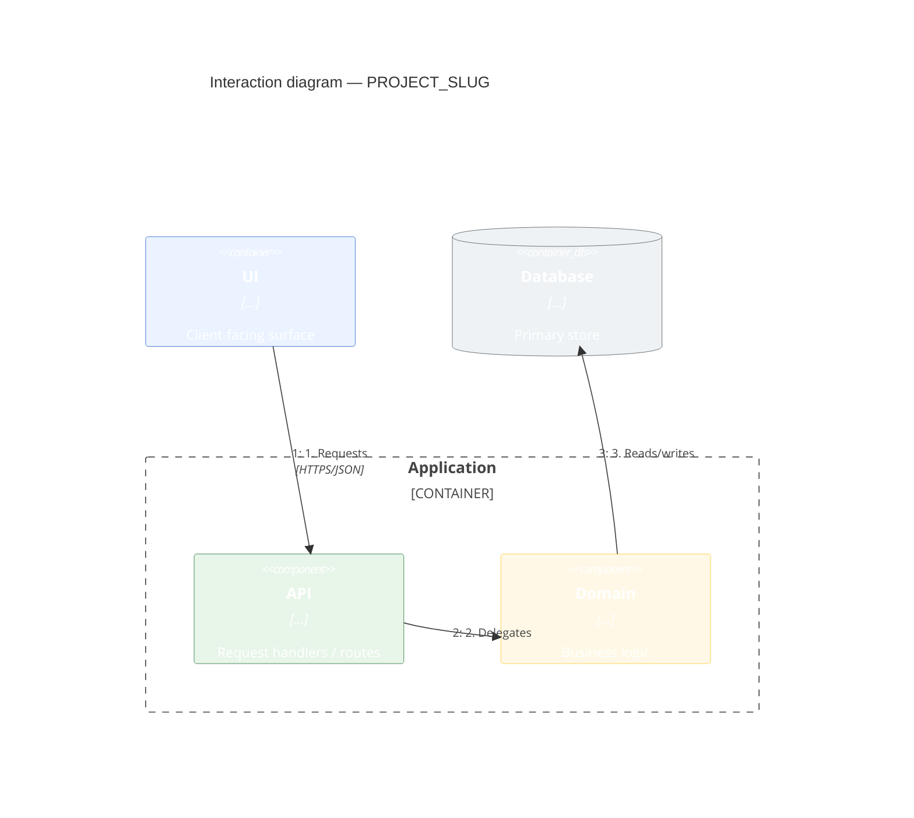

# Architecture

Project-wide structure only. Feature-specific sequence diagrams belong in [[projects/PROJECT_SLUG/solution-design|Solution design]].

## Purpose and scope

Architectural boundaries and what this page covers (and what it deliberately omits).

## Interaction diagram

Use a **Mermaid C4 Dynamic / interaction diagram** (`C4Dynamic`). Show numbered runtime interactions among major components derived from real call paths. Do not use flowchart or `C4Component` here. Feature-level sequences stay on Solution design pages.

Reference: [Mermaid C4 Dynamic](https://mermaid.js.org/syntax/c4.html) (interaction / dynamic view). Site theme + `UpdateElementStyle` supply colors.

> **Note:** If `C4Dynamic` fails to render in the browser, replace the fence with a `flowchart` that shows the same numbered interactions and include the phrase `C4Dynamic unavailable` in the block so `wiki-lint.py` accepts the fallback.

## Component responsibilities

| Component | Path / package | Responsibility |
|-----------|----------------|----------------|
| … | `…` | … |

## Key interactions and data flows

How components communicate (sync APIs, events, queues). Summarize; detail sequences on feature pages.

## Cross-cutting concerns

| Concern | Approach | Source |
|---------|----------|--------|
| Security | … | `workspace:…` |
| Observability | … | `workspace:…` |
| Error handling | … | `workspace:…` |
| Resilience | … | `workspace:…` |

## Deployment view

| Environment | Where components run | Notes |
|-------------|----------------------|-------|
| Local | … | … |
| Staging / prod | … | … |

## Key decisions and constraints

| Decision / constraint | Summary | Detail |
|-----------------------|---------|--------|
| … | Brief summary grounded in code | Optional link to ADR after verifying the code still matches |

## Related solution designs

- [[projects/PROJECT_SLUG/solution-design|Solution design hub]]

## Key claims

-

## See also

- [[projects/PROJECT_SLUG/index|Overview]]
- [[projects/PROJECT_SLUG/solution-design|Solution design]]
