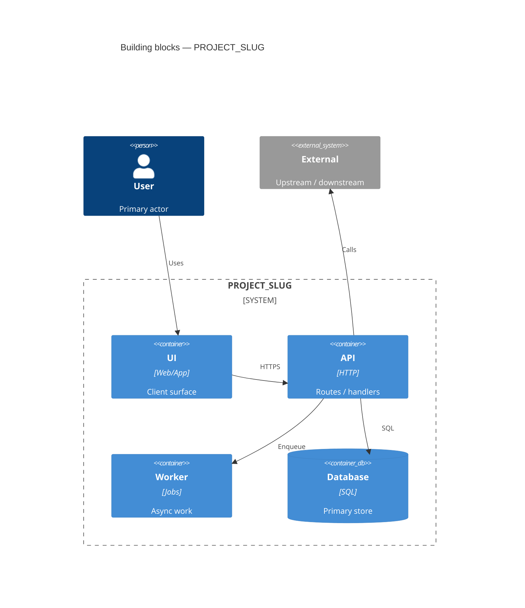
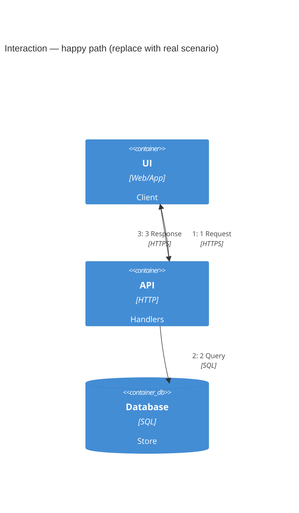

# Architecture

Project-wide structure only. Feature sequences belong in [[projects/PROJECT_SLUG/solution-design|Solution design]].

> **Tip** Keep this page at one abstraction level. Put feature sequences on Solution design pages.

## Purpose and quality goals

Boundaries this page covers (and what it omits). Top quality goals with a checkable signal from code or config.

| Goal | Metric or signal | Source |
|------|------------------|--------|
| … | e.g. p95 latency, RPO, consistency model | `workspace:…` |

## Building block view

Static structure at one abstraction level (deployable containers, or modules for a modular monolith). Same ids are reused in the Interaction diagram.

| Component | Path / package | Responsibility | Key interface |
|-----------|----------------|----------------|---------------|
| … | `…` | … | e.g. HTTP routes, queue topic |

## Interaction diagram

One or two architecturally relevant runtime scenarios. Numbered relations among the same building-block ids. Feature-level sequences stay on Solution design pages.

> **Note** Prefer `flowchart TB` with the phrase `C4Dynamic unavailable` when the scenario has return paths or more than three participants — Mermaid C4Dynamic often overlaps labels. If you keep `C4Dynamic`, you **must** include `UpdateLayoutConfig($c4ShapeInRow="1")` and avoid reverse Rel arrows on the same stack.

## Communication and data

Protocols, sync vs async, and data ownership — do not re-narrate the diagrams.

| From | To | Protocol | Sync / async | Data owned |
|------|----|----------|--------------|------------|
| … | … | HTTPS / gRPC / queue / … | sync / async | … |

## Cross-cutting concerns

Project-wide only. Feature-specific deltas go on Solution design pages.

| Concern | Approach | Source |
|---------|----------|--------|
| Security | … | `workspace:…` |
| Observability | … | `workspace:…` |
| Error handling | … | `workspace:…` |
| Resilience | … | `workspace:…` |

## Deployment view

| Environment | Where components run | Notes |
|-------------|----------------------|-------|
| Local | … | … |
| Staging / prod | … | … |

Add a deployment Mermaid when more than one deployable unit maps to distinct hosts or clusters.

## Risks and technical debt

| Risk or debt | Impact | Mitigation | Source |
|--------------|--------|------------|--------|
| … | … | … | `workspace:…` |

## Key decisions and constraints

| Decision | Status | Date | Summary | Consequences |
|----------|--------|------|---------|--------------|
| … | accepted / superseded / proposed | YYYY-MM-DD | Grounded in code | … |

Link an ADR only after confirming the code still matches.

## Related solution designs

- [[projects/PROJECT_SLUG/solution-design|Solution design hub]]

## Key claims

- Building blocks and quality signals match code at `validated_against` — `workspace:REPO_PATH`

## See also

- [[projects/PROJECT_SLUG/solution-design|Solution design]]
- [[projects/PROJECT_SLUG/glossary|Glossary]]
