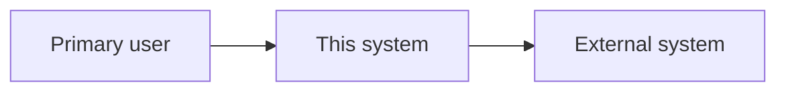

# Overview

## Purpose

What the project does and who it serves. Derive from entrypoints, package metadata, and main modules — not from README prose.

## Scope

| Included | Excluded |
|----------|----------|
| … | … |

## Key capabilities

- Capability 1
- Capability 2
- Capability 3

## System context diagram

Users, this system, and external systems. Replace nodes with real actors and integrations from the repo.

## Technology summary

| Technology / platform | Role | Source |
|-----------------------|------|--------|
| … | … | `workspace:…` |

Only list main technologies — not every transitive dependency.

## Key links

- [[projects/PROJECT_SLUG/quick-start|Quick start]]
- [[projects/PROJECT_SLUG/architecture|Architecture]]
- [[projects/PROJECT_SLUG/solution-design|Solution design]]
- Repository: `REPO_PATH` (or public URL if known)

## Key claims

- Grounded facts only; cite `workspace:` paths.

## See also

- [[projects/PROJECT_SLUG/glossary|Glossary]]
