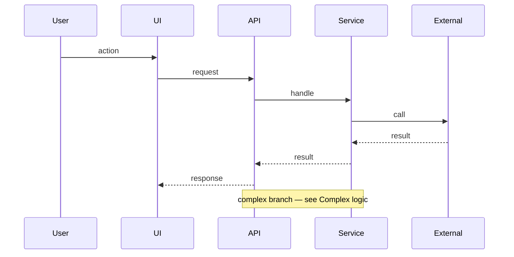

# FEATURE_TITLE

## Summary

| Field | Value |
|-------|-------|
| Problem | … |
| Goal | … |
| Owner | … |
| Status | draft / in progress / shipped |

## Scope and requirements

| In scope (behavior) | Acceptance criteria | Exclusions |
|---------------------|---------------------|------------|
| … | … | … |

## Design overview

Affected components (table only — the diagram for this page is the sequence diagram below).

| Component | Role in this feature | Source |
|-----------|----------------------|--------|
| … | … | `workspace:…` |

## Sequence diagram

Required. Use Mermaid **`sequenceDiagram` only** (not flowchart, not C4). Show the important interactions among users, services, assets, and external systems. Derive steps from real handlers/call sites. Site theme applies blue/green/amber colors automatically.



Reference: [Mermaid sequence diagrams](https://mermaid.js.org/syntax/sequenceDiagram.html).

## API contracts

Link to canonical OpenAPI / proto / event schemas in code. For each endpoint or event this feature owns, document the **API spec** plus **example request and response for success and error**.

### Spec summary

| Kind | Name / path | Method | Auth | Canonical source |
|------|-------------|--------|------|------------------|
| HTTP / event | `/…` | GET/POST/… | … | `workspace:…` |

### API spec

| Field | Value |
|-------|-------|
| Operation | … |
| Path / topic | … |
| Headers | … |
| Request schema | link or short field list from code |
| Success response | status / schema |
| Error responses | status codes and error body shape |

### Example — success

**Request** (curl — required form for every example request):

```bash
curl -sS -X POST 'https://example.local/…' \
  -H 'Authorization: Bearer $TOKEN' \
  -H 'Content-Type: application/json' \
  -d '{
    "…"
  }'
```

**Response** (status + body). If any field is an array, show **at least the first element** with realistic fields — do not use `[]` alone.

```json
{
  "items": [
    {
      "id": "…",
      "…"
    }
  ]
}
```

### Example — error

Document at least one realistic failure from the handler (validation, auth, not found, conflict, upstream). Prefer the status and body the code actually returns.

**Request** (curl):

```bash
curl -sS -X POST 'https://example.local/…' \
  -H 'Authorization: Bearer $TOKEN' \
  -H 'Content-Type: application/json' \
  -d '{
    "…"
  }'
```

**Response** (error status + body). If the error payload includes an array (e.g. field errors), show at least the first item.

```json
{
  "error": "…",
  "details": [
    {
      "field": "…",
      "message": "…"
    }
  ]
}
```

Compatibility notes: …

## Data and state changes

| Entity / store | Change | Lifecycle / migration |
|----------------|--------|------------------------|
| … | … | … |

## Complex logic

Rules, edge cases, and algorithms — only what exists in code. **Required:** cite the reference path and show a short example (trimmed from the real file, or a minimal equivalent that matches behavior).

| Rule / edge case | Behavior | Reference |
|------------------|----------|-----------|
| … | … | `workspace:path/to/file` (lines if known) |

### Reference / example code

```ts
// From workspace:path/to/file — trim to the decision branch only
```

## Failure and retry behavior

| Case | Timeout / retry | Idempotency | Recovery |
|------|-----------------|-------------|----------|
| … | … | … | … |

## Security and observability

| Area | Detail | Source |
|------|--------|--------|
| Permissions | … | `workspace:…` |
| Sensitive data | … | … |
| Logs / metrics / alerts | … | … |

## Testing and rollout

| Key tests | Release steps | Rollback |
|-----------|---------------|----------|
| … | … | … |

## Decisions and open questions

| Item | Type | Link / note |
|------|------|-------------|
| … | decision / open | … |

## Key claims

-

## See also

- [[projects/PROJECT_SLUG/solution-design|Solution design hub]]
- [[projects/PROJECT_SLUG/architecture|Architecture]]
