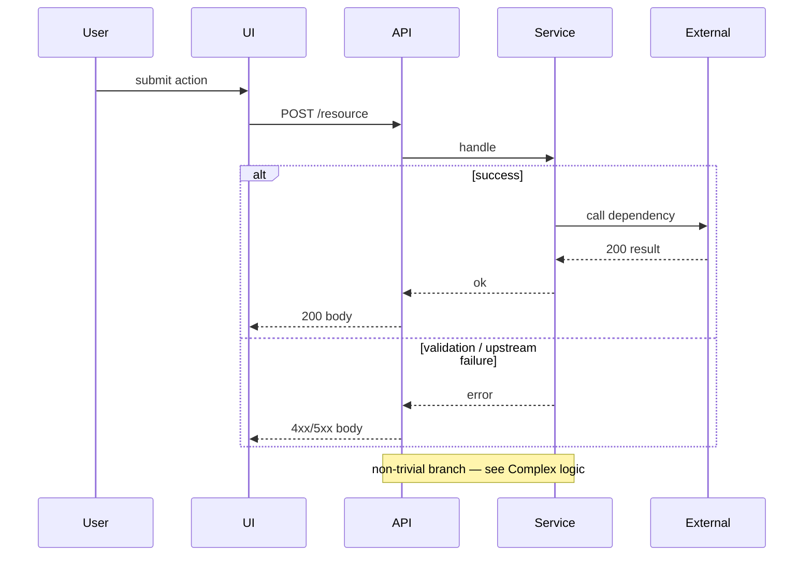

# FEATURE_TITLE

## Summary

| Field | Value |
|-------|-------|
| Problem | One sentence |
| Goal | One sentence (outcomes live under Business requirements) |
| Owner | … |
| Status | draft / in progress / shipped |

## Scope and requirements

### Business requirements

Outcomes, rules, constraints, KPIs — verified against how the code behaves.

| ID / theme | Business requirement | Priority | Notes |
|------------|----------------------|----------|-------|
| … | … | must / should / could | … |

### In scope / exclusions

| In scope (behavior) | Exclusions |
|---------------------|------------|
| … | … |

### Acceptance criteria

| ID | Given | When | Then |
|----|-------|------|------|
| AC1 | … | … | … |

## Design overview

Affected components (table only — diagram is the sequence below).

| Component | Role in this feature | Source |
|-----------|----------------------|--------|
| … | … | `workspace:…` |

## Sequence diagram

Mermaid **`sequenceDiagram` only**. Derive steps from real handlers. Include at least one `alt` or `opt` for a failure or edge path. Use concrete messages (`POST /orders`, not `request`).

> **Note** Happy path alone is not enough — document the main failure branch in `alt` or `opt`.



## API contracts

Always link the canonical schema/code. Full field tables and curl examples are required only when **Owns contract?** is `yes` (or `shared` with non-obvious behavior).

### Spec summary

| Kind | Name / path | Method | Auth | Owns contract? | Canonical source |
|------|-------------|--------|------|----------------|------------------|
| HTTP / event | `/…` | GET/POST/… | … | yes / no / shared | `workspace:…` |

When **Owns contract?** is `no` for every row: stop here (link only).

When any row is `yes` (or shared + non-obvious), fill the blocks below for each owned operation.

### API spec

| Field | Value |
|-------|-------|
| Operation | … |
| Path / topic | … |
| Headers | … |
| Success status | e.g. `200` / `201` |
| Error statuses | e.g. `400`, `401`, `404`, `409`, `5xx` |
| Canonical source | `workspace:…` |

Nested fields use dotted paths (e.g. `items[].id`). Example values must match the curl / JSON examples.

#### Request fields

| Field | Type | Required | Example value | Notes |
|-------|------|----------|---------------|-------|
| … | string / number / boolean / object / array | yes / no | `…` | … |

#### Response fields (success)

| Field | Type | Example value | Notes |
|-------|------|---------------|-------|
| … | … | `…` | … |
| items[] | array | _(see first item)_ | show ≥1 element in the JSON example |
| items[].id | string | `…` | … |

#### Response fields (error)

| Field | Type | Example value | Notes |
|-------|------|---------------|-------|
| error | string | `…` | … |
| details[] | array | _(see first item)_ | … |
| details[].field | string | `…` | … |
| details[].message | string | `…` | … |

### Example — success

Put **Request** or **Response** on its own line before each fence so HTML collapses them.

**Request** (curl)

```bash
curl -sS -X POST 'https://example.local/…' \
  -H 'Authorization: Bearer $TOKEN' \
  -H 'Content-Type: application/json' \
  -d '{
    "…"
  }'
```

**Response** (arrays show ≥1 item)

```json
{
  "items": [
    {
      "id": "…",
      "…"
    }
  ]
}
```

### Example — error

Use a realistic failure the handler returns.

**Request** (curl)

```bash
curl -sS -X POST 'https://example.local/…' \
  -H 'Authorization: Bearer $TOKEN' \
  -H 'Content-Type: application/json' \
  -d '{
    "…"
  }'
```

**Response**

```json
{
  "error": "…",
  "details": [
    {
      "field": "…",
      "message": "…"
    }
  ]
}
```

### Compatibility

Breaking-change or version notes, or omit if none.

## Data and state changes

| Entity / store | Change | Lifecycle / migration |
|----------------|--------|------------------------|
| … | … | … |

## Complex logic

Non-trivial rules only. If none: `N/A — no non-trivial branches` plus one `workspace:` cite for the main handler.

| Rule / edge case | Behavior | Reference |
|------------------|----------|-----------|
| … | … | `workspace:path/to/file` |

### Reference / example code

```ts
// From workspace:path/to/file — trim to the decision branch only
```

## Failure and retry behavior

If sync-only with no retries: `N/A — no async retry path` plus one `workspace:` cite.

| Case | Timeout / retry | Idempotency | Recovery |
|------|-----------------|-------------|----------|
| … | … | … | … |

## Cross-cutting deltas

Only what differs from [[projects/PROJECT_SLUG/architecture|Architecture]]. If none: `N/A — inherits Architecture`.

| Area | Delta | Source |
|------|-------|--------|
| Permissions | … | `workspace:…` |
| Sensitive data | … | … |
| Logs / metrics / alerts | … | … |

## Testing and rollout

**Key tests**

- …

**Release**

- …

**Rollback**

- …

## Decisions and open questions

| Item | Type | Link / note |
|------|------|-------------|
| … | decision / open | … |

## Key claims

- Feature behavior matches code at `validated_against` — `workspace:REPO_PATH`

## See also

- [[projects/PROJECT_SLUG/solution-design|Solution design hub]]
- [[projects/PROJECT_SLUG/architecture|Architecture]]
